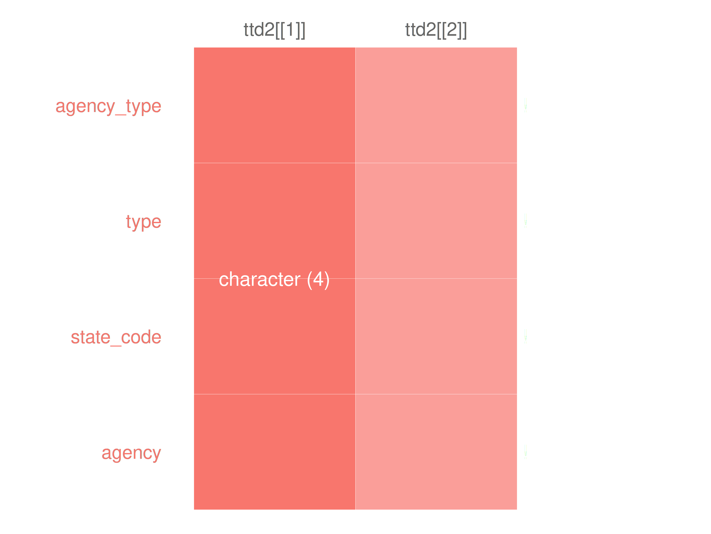
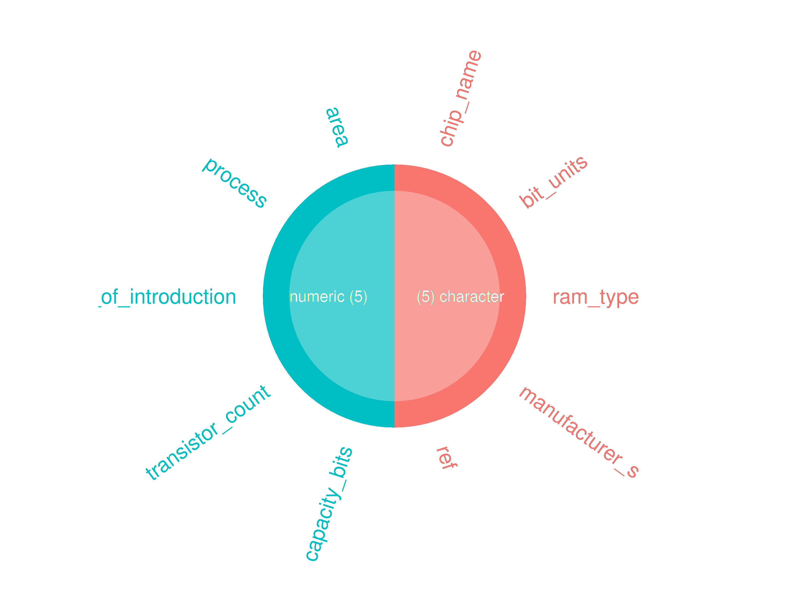
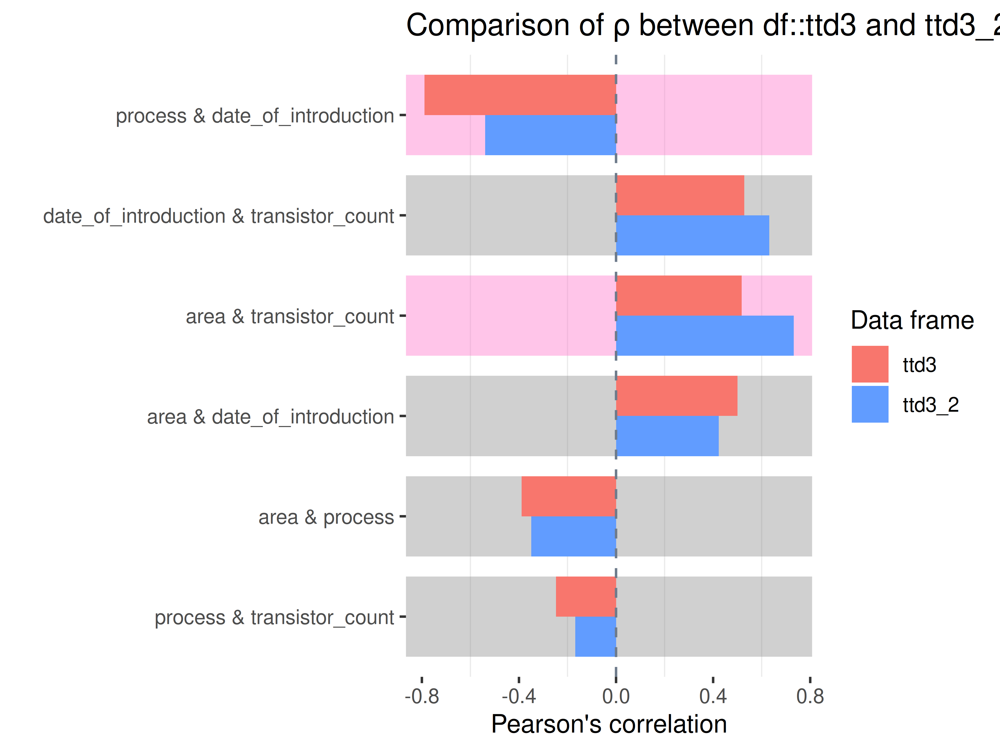
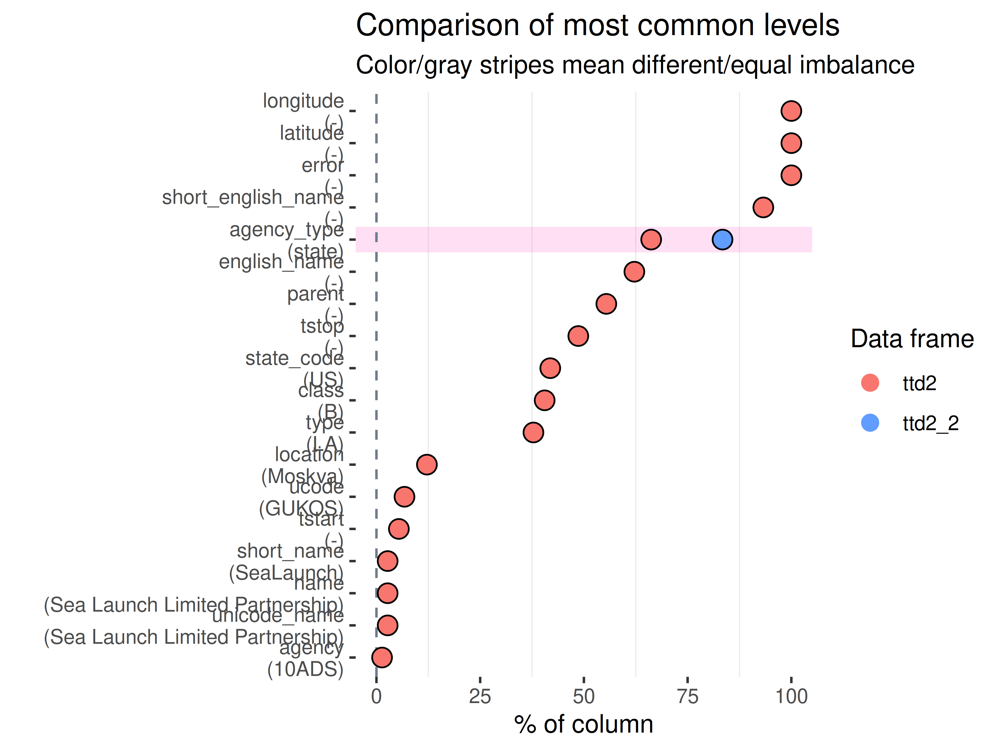
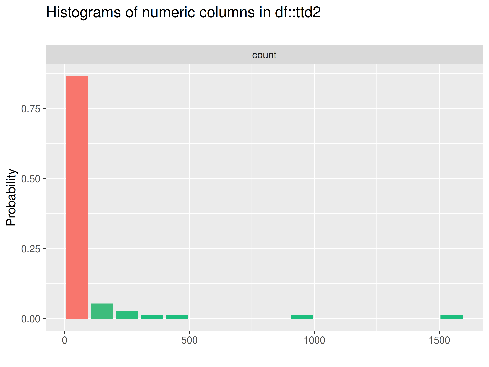
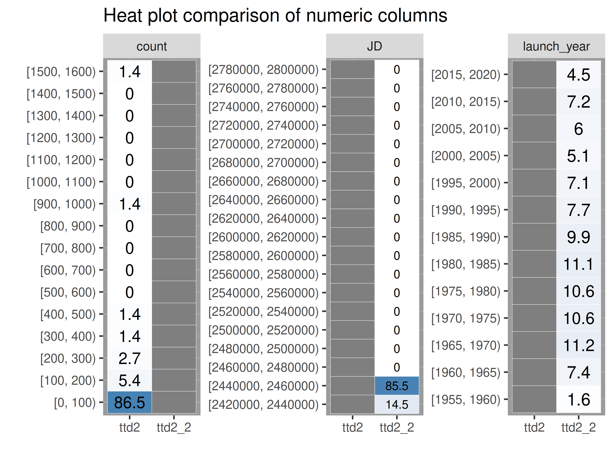
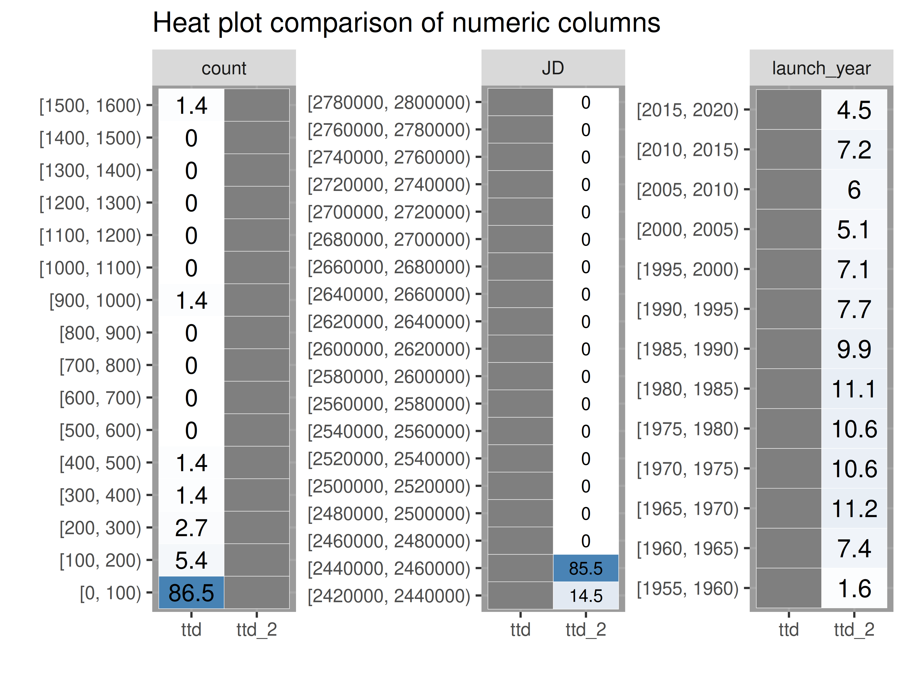
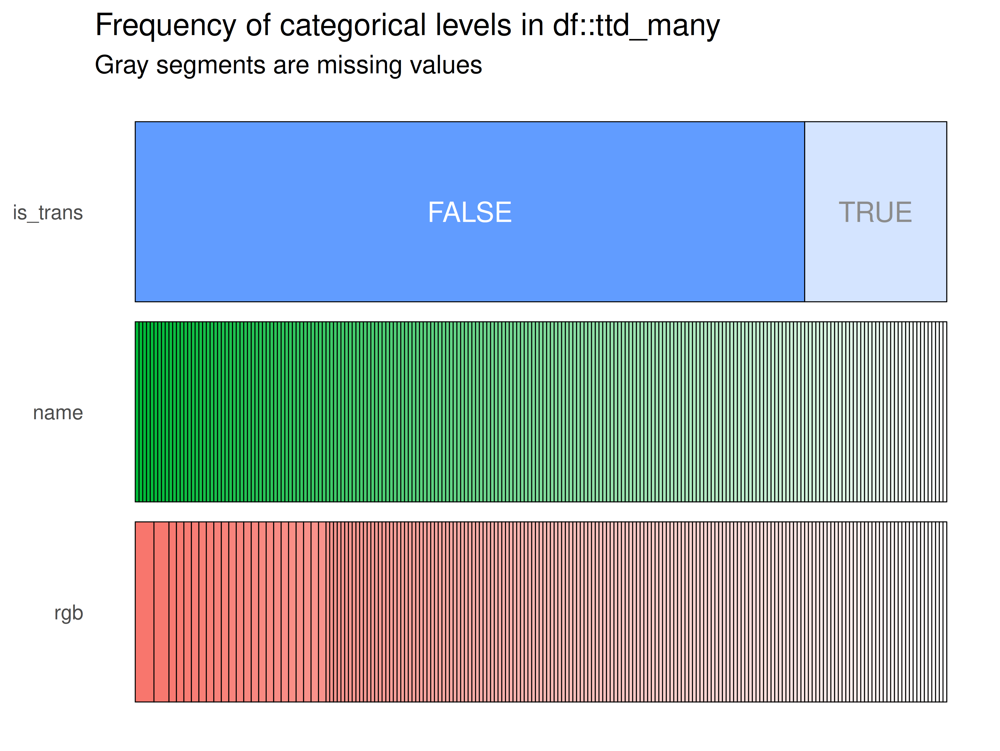
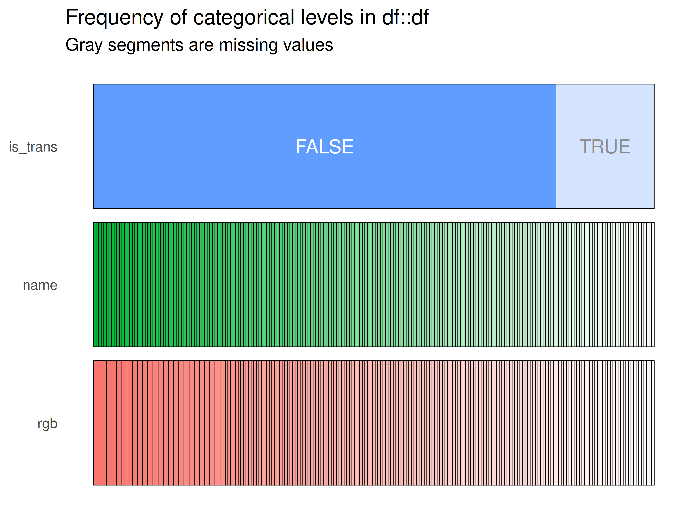

# Graphs

``` r
library(ttdviewer)
library(inspectdf)
library(dplyr)
library(tidyr)
```

Below are examples of the data visualizations using `inspectdf` in the
Shiny app.

## Data

We’ll need data to demonstrate how the
[`inspect_plot()`](https://mjfrigaard.github.io/ttdviewer/reference/inspect_plot.md)
function works. We’ll use the
[`load_tt_data()`](https://mjfrigaard.github.io/ttdviewer/reference/load_tt_data.md)
function to collect four lists of data from the
[TidyTuesday](https://github.com/rfordatascience/tidytuesday) repo.

`"Netflix Titles"` has a single dataset:

``` r
ttd <- load_tt_data("Netflix Titles")
#> INFO [2026-01-15 19:44:57] Starting import for netflix_titles.csv from https://raw.githubusercontent.com/rfordatascience/tidytuesday/refs/heads/main/data/2021/2021-04-20/netflix_titles.csv
#> SUCCESS [2026-01-15 19:44:57] Successfully loaded netflix_titles.csv
purrr::map(.x = ttd, .f = attr, "clean_title")
#> $netflix_titles.csv
#> [1] "netflix_titles"
# for a list with two datasets, we'll use the `"Space Launches"` data
ttd2 <- load_tt_data("Space Launches")
#> INFO [2026-01-15 19:44:57] Starting import for agencies.csv from https://raw.githubusercontent.com/rfordatascience/tidytuesday/refs/heads/main/data/2019/2019-01-15/agencies.csv
#> SUCCESS [2026-01-15 19:44:57] Successfully loaded agencies.csv
#> INFO [2026-01-15 19:44:57] Starting import for launches.csv from https://raw.githubusercontent.com/rfordatascience/tidytuesday/refs/heads/main/data/2019/2019-01-15/launches.csv
#> SUCCESS [2026-01-15 19:44:58] Successfully loaded launches.csv
purrr::map(.x = ttd2, .f = attr, "clean_title")
#> $agencies.csv
#> [1] "space_launches"
#> 
#> $launches.csv
#> [1] "space_launches"
# "Moore's Law" contains three datasets
ttd3 <- load_tt_data("Moore’s Law")
#> INFO [2026-01-15 19:44:58] Starting import for cpu.csv from https://raw.githubusercontent.com/rfordatascience/tidytuesday/refs/heads/main/data/2019/2019-09-03/cpu.csv
#> SUCCESS [2026-01-15 19:44:58] Successfully loaded cpu.csv
#> INFO [2026-01-15 19:44:58] Starting import for gpu.csv from https://raw.githubusercontent.com/rfordatascience/tidytuesday/refs/heads/main/data/2019/2019-09-03/gpu.csv
#> SUCCESS [2026-01-15 19:44:58] Successfully loaded gpu.csv
#> INFO [2026-01-15 19:44:58] Starting import for ram.csv from https://raw.githubusercontent.com/rfordatascience/tidytuesday/refs/heads/main/data/2019/2019-09-03/ram.csv
#> SUCCESS [2026-01-15 19:44:58] Successfully loaded ram.csv
purrr::map(.x = ttd3, .f = attr, "clean_title")
#> $cpu.csv
#> [1] "moores_law"
#> 
#> $gpu.csv
#> [1] "moores_law"
#> 
#> $ram.csv
#> [1] "moores_law"
# finally, we'll download the "LEGO database" data with 12 datasets into the
# ttd_many list:
ttd_many <- load_tt_data("LEGO database")
#> INFO [2026-01-15 19:44:58] Starting import for colors.csv.gz from https://raw.githubusercontent.com/rfordatascience/tidytuesday/refs/heads/main/data/2022/2022-09-06/colors.csv.gz
#> SUCCESS [2026-01-15 19:44:58] Successfully loaded colors.csv.gz
#> INFO [2026-01-15 19:44:58] Starting import for elements.csv.gz from https://raw.githubusercontent.com/rfordatascience/tidytuesday/refs/heads/main/data/2022/2022-09-06/elements.csv.gz
#> SUCCESS [2026-01-15 19:44:58] Successfully loaded elements.csv.gz
#> INFO [2026-01-15 19:44:58] Starting import for inventories.csv.gz from https://raw.githubusercontent.com/rfordatascience/tidytuesday/refs/heads/main/data/2022/2022-09-06/inventories.csv.gz
#> SUCCESS [2026-01-15 19:44:58] Successfully loaded inventories.csv.gz
#> INFO [2026-01-15 19:44:58] Starting import for inventory_minifigs.csv.gz from https://raw.githubusercontent.com/rfordatascience/tidytuesday/refs/heads/main/data/2022/2022-09-06/inventory_minifigs.csv.gz
#> SUCCESS [2026-01-15 19:44:58] Successfully loaded inventory_minifigs.csv.gz
#> INFO [2026-01-15 19:44:58] Starting import for inventory_parts.csv.gz from https://raw.githubusercontent.com/rfordatascience/tidytuesday/refs/heads/main/data/2022/2022-09-06/inventory_parts.csv.gz
#> SUCCESS [2026-01-15 19:44:58] Successfully loaded inventory_parts.csv.gz
#> INFO [2026-01-15 19:44:58] Starting import for inventory_sets.csv.gz from https://raw.githubusercontent.com/rfordatascience/tidytuesday/refs/heads/main/data/2022/2022-09-06/inventory_sets.csv.gz
#> SUCCESS [2026-01-15 19:44:58] Successfully loaded inventory_sets.csv.gz
#> INFO [2026-01-15 19:44:58] Starting import for minifigs.csv.gz from https://raw.githubusercontent.com/rfordatascience/tidytuesday/refs/heads/main/data/2022/2022-09-06/minifigs.csv.gz
#> SUCCESS [2026-01-15 19:44:58] Successfully loaded minifigs.csv.gz
#> INFO [2026-01-15 19:44:58] Starting import for part_categories.csv.gz from https://raw.githubusercontent.com/rfordatascience/tidytuesday/refs/heads/main/data/2022/2022-09-06/part_categories.csv.gz
#> SUCCESS [2026-01-15 19:44:59] Successfully loaded part_categories.csv.gz
#> INFO [2026-01-15 19:44:59] Starting import for part_relationships.csv.gz from https://raw.githubusercontent.com/rfordatascience/tidytuesday/refs/heads/main/data/2022/2022-09-06/part_relationships.csv.gz
#> SUCCESS [2026-01-15 19:44:59] Successfully loaded part_relationships.csv.gz
#> INFO [2026-01-15 19:44:59] Starting import for parts.csv.gz from https://raw.githubusercontent.com/rfordatascience/tidytuesday/refs/heads/main/data/2022/2022-09-06/parts.csv.gz
#> SUCCESS [2026-01-15 19:44:59] Successfully loaded parts.csv.gz
#> INFO [2026-01-15 19:44:59] Starting import for sets.csv.gz from https://raw.githubusercontent.com/rfordatascience/tidytuesday/refs/heads/main/data/2022/2022-09-06/sets.csv.gz
#> SUCCESS [2026-01-15 19:44:59] Successfully loaded sets.csv.gz
#> INFO [2026-01-15 19:44:59] Starting import for themes.csv.gz from https://raw.githubusercontent.com/rfordatascience/tidytuesday/refs/heads/main/data/2022/2022-09-06/themes.csv.gz
#> SUCCESS [2026-01-15 19:44:59] Successfully loaded themes.csv.gz
purrr::map(.x = ttd_many, .f = attr, "clean_title")
#> $colors.csv.gz
#> [1] "lego_database"
#> 
#> $elements.csv.gz
#> [1] "lego_database"
#> 
#> $inventories.csv.gz
#> [1] "lego_database"
#> 
#> $inventory_minifigs.csv.gz
#> [1] "lego_database"
#> 
#> $inventory_parts.csv.gz
#> [1] "lego_database"
#> 
#> $inventory_sets.csv.gz
#> [1] "lego_database"
#> 
#> $minifigs.csv.gz
#> [1] "lego_database"
#> 
#> $part_categories.csv.gz
#> [1] "lego_database"
#> 
#> $part_relationships.csv.gz
#> [1] "lego_database"
#> 
#> $parts.csv.gz
#> [1] "lego_database"
#> 
#> $sets.csv.gz
#> [1] "lego_database"
#> 
#> $themes.csv.gz
#> [1] "lego_database"
```

## Utility functions

The
[`inspect_plot()`](https://mjfrigaard.github.io/ttdviewer/reference/inspect_plot.md)
function has the following utility functions:

### Check length

Check the length of the `ttd3` list with
[`ttd_length()`](https://mjfrigaard.github.io/ttdviewer/reference/ttd_length.md):

``` r
ttd_length(ttd = ttd3)
#> [1] 3
```

### Check numeric columns

Check if datasets have numerical columns:

``` r
check_ttd_num_cols(ttd = ttd3)
#> $cpu.csv
#> [1] "transistor_count"     "date_of_introduction" "process"             
#> [4] "area"                
#> 
#> $gpu.csv
#> [1] "transistor_count"     "date_of_introduction" "process"             
#> [4] "area"                
#> 
#> $ram.csv
#> [1] "capacity_bits"        "transistor_count"     "date_of_introduction"
#> [4] "process"              "area"
```

- If so, do they have two or more?

### Check categorical columns

Check if datasets have categorical (character) columns:

``` r
check_ttd_cat_cols(ttd3)
#> $cpu.csv
#> [1] "processor" "designer" 
#> 
#> $gpu.csv
#> [1] "processor"      "designer_s"     "manufacturer_s" "ref"           
#> 
#> $ram.csv
#> [1] "chip_name"      "bit_units"      "ram_type"       "manufacturer_s"
#> [5] "ref"
```

### Check list columns

Check list columns:

``` r
check_ttd_list_cols(ttd3)
#> $cpu.csv
#> [1] 0
#> 
#> $gpu.csv
#> [1] 0
#> 
#> $ram.csv
#> [1] 0
```

### Check logical columns

Check logical columns:

``` r
check_ttd_log_cols(ttd3)
#> $cpu.csv
#> [1] 0
#> 
#> $gpu.csv
#> [1] 0
#> 
#> $ram.csv
#> [1] 0
```

### Check date columns

Check date columns:

``` r
check_ttd_date_cols(ttd3)
#> $cpu.csv
#> [1] 0
#> 
#> $gpu.csv
#> [1] 0
#> 
#> $ram.csv
#> [1] 0
```

### check_col_types()

These are wrapped in the
[`check_col_types()`](https://mjfrigaard.github.io/ttdviewer/reference/check_col_types.md)
function:

``` r
identical( # check the
  x = length(check_col_types(ttd = ttd3, type = "cat")),
  y = length(check_ttd_cat_cols(ttd3))
)
#> [1] TRUE
```

``` r
identical(
  x = length(check_col_types(ttd = ttd3, type = "date")),
  y = length(check_ttd_date_cols(ttd3))
)
#> [1] TRUE
```

``` r
identical(
  x = length(check_col_types(ttd = ttd3, type = "log")),
  y = length(check_ttd_log_cols(ttd3))
)
#> [1] TRUE
```

``` r
identical(
  x = length(check_col_types(ttd = ttd3, type = "num")),
  y = length(check_ttd_num_cols(ttd3))
)
#> [1] TRUE
```

The functions above allow us to collect the following:

1.  Determine the number of datasets in the `ttd` list  
2.  Determine the name of the datasets in the `ttd` list  
3.  Determine the number of numerical columns in each dataset in the
    `ttd` list  
4.  Determine the names of any intersecting numerical columns in each
    dataset in the `ttd` list  
5.  Determine the number of categorical columns in each dataset in the
    `ttd` list  
6.  Determine the names of any intersecting categorical columns in each
    dataset in the `ttd` list  
7.  Determine the number of logical columns in each dataset in the `ttd`
    list  
8.  Determine the number of date columns in each dataset in the `ttd`
    list  
9.  Determine the names of any date columns in each dataset in the `ttd`
    list  
10. Determine the number of list columns in each dataset in the `ttd`
    list  
11. Determine the names of any list columns in each dataset in the `ttd`
    list

## Function logic

Using the functions above, write the custom
[`inspect_plot()`](https://mjfrigaard.github.io/ttdviewer/reference/inspect_plot.md)
function and have it adhere to the following rules:

### inspect_types()

#### `if (length(ttd) == 1)`

If one dataset in `ttd`:

``` r
inspectdf::inspect_types(
  df1 = ttd2[[1]],
  df2 = NULL
) |>
  inspectdf::show_plot(text_labels = TRUE)
```


``` r
inspect_plot(ttd = 
    list("agencies.csv" = ttd2[[1]]), 
  plots = "types")
#> INFO [2026-01-15 19:45:00] inspect_plot(): starting analysis
#> INFO [2026-01-15 19:45:00] Beginning plot type 'types'
```


    #> SUCCESS [2026-01-15 19:45:00] Completed plot type 'types'
    #> SUCCESS [2026-01-15 19:45:00] inspect_plot(): all requested plots finished
    #> NULL

#### `if (length(ttd) == 2)`

If two datasets in `ttd`:

- check for intersecting columns

- if columns intersect, store column names as `intersecting_columns`

``` r
if (length(intersect(names(ttd2[[1]]), names(ttd2[[2]]))) > 0) {
  intersecting_columns <- intersect(
  x = names(ttd2[[1]]), 
  y = names(ttd2[[2]])
  )
}
```

- Then use `intersecting_columns` to subset `ttd` for the
  [`inspect_cat()`](https://alastairrushworth.github.io/inspectdf/reference/inspect_cat.html)
  function:

``` r
inspectdf::inspect_types(
  df1 = ttd2[[1]][intersecting_columns],
  df2 = ttd2[[2]][intersecting_columns],
) |>
  inspectdf::show_plot(text_labels = TRUE)
#> Warning: Using `size` aesthetic for lines was deprecated in ggplot2 3.4.0.
#> ℹ Please use `linewidth` instead.
#> ℹ The deprecated feature was likely used in the inspectdf package.
#>   Please report the issue at
#>   <https://github.com/alastairrushworth/inspectdf/issues>.
#> This warning is displayed once per session.
#> Call `lifecycle::last_lifecycle_warnings()` to see where this warning was
#> generated.
```



#### `if (length(ttd) >= 3)`

If more than two datasets in `ttd`:

``` r
inspectdf::inspect_types(
  df1 = ttd3[[1]],
  df2 = NULL
) |>
  inspectdf::show_plot(text_labels = TRUE)
```


``` r
inspect_plot(
  ttd = list("cpu.csv" = ttd3[[1]]),
  plots = "types"
  )
#> INFO [2026-01-15 19:45:04] inspect_plot(): starting analysis
#> INFO [2026-01-15 19:45:04] Beginning plot type 'types'
```


    #> SUCCESS [2026-01-15 19:45:04] Completed plot type 'types'
    #> SUCCESS [2026-01-15 19:45:04] inspect_plot(): all requested plots finished
    #> NULL

``` r
inspectdf::inspect_types(
  df1 = ttd3[[2]],
  df2 = NULL
) |>
  inspectdf::show_plot(text_labels = TRUE)
```


``` r
inspect_plot(
  ttd = list("gpu.csv" = ttd3[[2]]), 
  plots = "types"
  )
#> INFO [2026-01-15 19:45:06] inspect_plot(): starting analysis
#> INFO [2026-01-15 19:45:06] Beginning plot type 'types'
```


    #> SUCCESS [2026-01-15 19:45:06] Completed plot type 'types'
    #> SUCCESS [2026-01-15 19:45:06] inspect_plot(): all requested plots finished
    #> NULL

``` r
inspectdf::inspect_types(
  df1 = ttd3[[3]],
  df2 = NULL
) |>
  inspectdf::show_plot(text_labels = TRUE)
```


``` r
inspect_plot(
  ttd = list("ram.csv" = ttd3[[3]]), 
  plots = "types"
  )
#> INFO [2026-01-15 19:45:08] inspect_plot(): starting analysis
#> INFO [2026-01-15 19:45:08] Beginning plot type 'types'
```



    #> SUCCESS [2026-01-15 19:45:08] Completed plot type 'types'
    #> SUCCESS [2026-01-15 19:45:08] inspect_plot(): all requested plots finished
    #> NULL

### inspect_mem()

#### `if (length(ttd) == 1)`

If one dataset in `ttd`:

``` r
inspectdf::inspect_mem(
  df1 = ttd[[1]],
  df2 = NULL) |>
  inspectdf::show_plot(text_labels = TRUE)
```


``` r
inspect_plot(
  ttd = list("netflix_titles.csv" = ttd[[1]]), 
  plots = "mem"
  )
#> INFO [2026-01-15 19:45:10] inspect_plot(): starting analysis
#> INFO [2026-01-15 19:45:10] Beginning plot type 'mem'
```


    #> SUCCESS [2026-01-15 19:45:10] Completed plot type 'mem'
    #> SUCCESS [2026-01-15 19:45:10] inspect_plot(): all requested plots finished
    #> NULL

#### `if (length(ttd) == 2)`

If two datasets in `ttd`:

``` r
inspectdf::inspect_mem(
  df1 = ttd2[[1]], 
  df2 = ttd2[[2]]) |>
  inspectdf::show_plot(text_labels = TRUE)
```


``` r
inspect_plot(
  ttd = list(
    "agencies.csv" = ttd2[[1]],
    "launches.csv" = ttd2[[2]]
    ), 
  plots = "mem")
#> INFO [2026-01-15 19:45:12] inspect_plot(): starting analysis
#> INFO [2026-01-15 19:45:12] Beginning plot type 'mem'
```


    #> SUCCESS [2026-01-15 19:45:13] Completed plot type 'mem'
    #> SUCCESS [2026-01-15 19:45:13] inspect_plot(): all requested plots finished
    #> NULL

#### `if (length(ttd) >= 3)`

If more than two datasets in `ttd`:

``` r
inspectdf::inspect_mem(
  df1 = ttd3[[1]],
  df2 = NULL
) |>
  inspectdf::show_plot(text_labels = TRUE)
```


``` r
inspect_plot(
  ttd = list("cpu.csv" = ttd3[[1]]), 
  plots = "mem"
  )
#> INFO [2026-01-15 19:45:15] inspect_plot(): starting analysis
#> INFO [2026-01-15 19:45:15] Beginning plot type 'mem'
```


    #> SUCCESS [2026-01-15 19:45:15] Completed plot type 'mem'
    #> SUCCESS [2026-01-15 19:45:15] inspect_plot(): all requested plots finished
    #> NULL

``` r
inspectdf::inspect_mem(
  df1 = ttd3[[2]],
  df2 = NULL
) |>
  inspectdf::show_plot(text_labels = TRUE)
```


``` r
inspect_plot(
  ttd = list("gpu.csv" = ttd3[[2]]), 
  plots = "mem"
  )
#> INFO [2026-01-15 19:45:16] inspect_plot(): starting analysis
#> INFO [2026-01-15 19:45:16] Beginning plot type 'mem'
```


    #> SUCCESS [2026-01-15 19:45:16] Completed plot type 'mem'
    #> SUCCESS [2026-01-15 19:45:16] inspect_plot(): all requested plots finished
    #> NULL

``` r
inspectdf::inspect_mem(
  df1 = ttd3[[3]],
  df2 = NULL
) |>
  inspectdf::show_plot(text_labels = TRUE)
```


``` r
# ... for all datasets in ttd list
```

``` r
inspect_plot(
  ttd = list("ram.csv" = ttd3[[3]]), 
  plots = "mem"
  )
#> INFO [2026-01-15 19:45:18] inspect_plot(): starting analysis
#> INFO [2026-01-15 19:45:18] Beginning plot type 'mem'
```


    #> SUCCESS [2026-01-15 19:45:18] Completed plot type 'mem'
    #> SUCCESS [2026-01-15 19:45:18] inspect_plot(): all requested plots finished
    #> NULL

### inspect_cor()

#### `if (length(ttd) == 1)`

If one dataset in `ttd`:

- check if there are at least 2 numeric columns in the datasets in the
  `ttd` list
  - Plot the dataset with at least two numeric columns

``` r
if (ttd_length(ttd2) == 2) { # check for two datasets
  # check for two numerical columns in ttd[[1]]
  if (length(check_ttd_num_cols(ttd = ttd2)[[1]]) == 2) {
    # plot first dataset
    inspectdf::inspect_cor(
      df1 = ttd2[[1]],
      df2 = NULL,
      method = "pearson",
      with_col = NULL,
      alpha = 0.05
    ) |>
      inspectdf::show_plot(text_labels = TRUE)
    # check for two numerical columns in ttd[[2]]
  } else if (length(check_ttd_num_cols(ttd = ttd2)[[2]]) >= 2) {
    # plot second dataset
    inspectdf::inspect_cor(
      df1 = ttd2[[2]],
      df2 = NULL,
      method = "pearson",
      with_col = NULL,
      alpha = 0.05
    ) |>
      inspectdf::show_plot(text_labels = TRUE)
  } else {
    logr_msg("Error", level = "INFO")
  }
}
```


``` r
inspect_plot(
  ttd = list(
    "launches.csv" = ttd2[[2]]
    ), 
  plots = "cor"
  )
#> INFO [2026-01-15 19:45:20] inspect_plot(): starting analysis
#> INFO [2026-01-15 19:45:20] Beginning plot type 'cor'
```


    #> SUCCESS [2026-01-15 19:45:20] Completed plot type 'cor'
    #> SUCCESS [2026-01-15 19:45:20] inspect_plot(): all requested plots finished
    #> NULL

#### `if (length(ttd) == 2)`

If two datasets in `ttd`:

- check if there is at least 1 numeric column in each dataset from the
  `ttd` list

``` r
check_col_types(ttd2, type = "num")
#> $agencies.csv
#> [1] "count"
#> 
#> $launches.csv
#> [1] "JD"          "launch_year"
```

``` r
check_col_types(ttd3, type = "num")
#> $cpu.csv
#> [1] "transistor_count"     "date_of_introduction" "process"             
#> [4] "area"                
#> 
#> $gpu.csv
#> [1] "transistor_count"     "date_of_introduction" "process"             
#> [4] "area"                
#> 
#> $ram.csv
#> [1] "capacity_bits"        "transistor_count"     "date_of_introduction"
#> [4] "process"              "area"
```

- Run
  [`inspectdf::inspect_cor()`](https://alastairrushworth.github.io/inspectdf/reference/inspect_cor.html)if
  at least one numerical column is in each dataset:

``` r
inspectdf::inspect_cor(
  df1 = ttd3[[1]],
  df2 = ttd3[[2]],
  method = "pearson",
  with_col = NULL,
  alpha = 0.05
) |>
  inspectdf::show_plot(text_labels = TRUE)
```



``` r
inspect_plot(
  ttd = list(
    "cpu.csv" = ttd3[[1]],
    "gpu.csv" = ttd3[[2]]
  ), 
  plots = "cor"
  )
#> INFO [2026-01-15 19:45:22] inspect_plot(): starting analysis
#> INFO [2026-01-15 19:45:22] Beginning plot type 'cor'
```


    #> SUCCESS [2026-01-15 19:45:22] Completed plot type 'cor'
    #> SUCCESS [2026-01-15 19:45:22] inspect_plot(): all requested plots finished
    #> NULL

#### `if (length(ttd) >= 3)`

If more than two datasets in `ttd`:

- check if there is at least 1 numeric column in each of the datasets
  from the `ttd` list:

``` r
check_col_types(ttd3, type = "num")
#> $cpu.csv
#> [1] "transistor_count"     "date_of_introduction" "process"             
#> [4] "area"                
#> 
#> $gpu.csv
#> [1] "transistor_count"     "date_of_introduction" "process"             
#> [4] "area"                
#> 
#> $ram.csv
#> [1] "capacity_bits"        "transistor_count"     "date_of_introduction"
#> [4] "process"              "area"
```

- Run the following on all datasets with at least two numerical columns.

``` r
inspectdf::inspect_cor(
  df1 = ttd3[[1]],
  df2 = NULL,
  method = "pearson",
  with_col = NULL,
  alpha = 0.05
) |>
  inspectdf::show_plot(text_labels = TRUE)
```


``` r
inspect_plot(
  ttd = list("cpu.csv" = ttd3[[1]]), 
  plots = "cor")
#> INFO [2026-01-15 19:45:23] inspect_plot(): starting analysis
#> INFO [2026-01-15 19:45:23] Beginning plot type 'cor'
```


    #> SUCCESS [2026-01-15 19:45:24] Completed plot type 'cor'
    #> SUCCESS [2026-01-15 19:45:24] inspect_plot(): all requested plots finished
    #> NULL

``` r
inspectdf::inspect_cor(
  df1 = ttd3[[2]],
  df2 = NULL,
  method = "pearson",
  with_col = NULL,
  alpha = 0.05
) |>
  inspectdf::show_plot(text_labels = TRUE)
```


``` r
inspect_plot(
  ttd = list("gpu.csv" = ttd3[[2]]), 
  plots = "cor")
#> INFO [2026-01-15 19:45:25] inspect_plot(): starting analysis
#> INFO [2026-01-15 19:45:25] Beginning plot type 'cor'
```


    #> SUCCESS [2026-01-15 19:45:25] Completed plot type 'cor'
    #> SUCCESS [2026-01-15 19:45:25] inspect_plot(): all requested plots finished
    #> NULL

``` r
inspectdf::inspect_cor(
  df1 = ttd3[[3]],
  df2 = NULL,
  method = "pearson",
  with_col = NULL,
  alpha = 0.05
) |>
  inspectdf::show_plot(text_labels = TRUE)
```


``` r
inspect_plot(
  ttd = list("ram.csv" = ttd3[[3]]), 
  plots = "cor")
#> INFO [2026-01-15 19:45:27] inspect_plot(): starting analysis
#> INFO [2026-01-15 19:45:27] Beginning plot type 'cor'
```


    #> SUCCESS [2026-01-15 19:45:27] Completed plot type 'cor'
    #> SUCCESS [2026-01-15 19:45:27] inspect_plot(): all requested plots finished
    #> NULL
    # for all other dataset in the list

### inspect_imb()

#### `if (length(ttd) == 1)`

If one dataset in `ttd`:

``` r
inspectdf::inspect_imb(
  df1 = ttd[[1]],
  df2 = NULL,
  include_na = FALSE
) |>
  inspectdf::show_plot(text_labels = TRUE)
```


``` r
inspect_plot(
  ttd = list("netflix_titles.csv" = ttd[[1]]), 
  plots = "imb")
#> INFO [2026-01-15 19:45:29] inspect_plot(): starting analysis
#> INFO [2026-01-15 19:45:29] Beginning plot type 'imb'
```


    #> SUCCESS [2026-01-15 19:45:29] Completed plot type 'imb'
    #> SUCCESS [2026-01-15 19:45:29] inspect_plot(): all requested plots finished
    #> NULL

#### `if (length(ttd) == 2)`

If two datasets in `ttd`:

``` r
inspectdf::inspect_imb(
  df1 = ttd2[[1]],
  df2 = ttd2[[2]],
  include_na = FALSE
) |>
  inspectdf::show_plot(text_labels = TRUE)
```



``` r
inspect_plot(
  ttd = list(
    "agencies.csv" = ttd2[[1]],
    "launches.csv" = ttd2[[2]]
    ), 
  plots = "imb")
#> INFO [2026-01-15 19:45:31] inspect_plot(): starting analysis
#> INFO [2026-01-15 19:45:31] Beginning plot type 'imb'
```


    #> SUCCESS [2026-01-15 19:45:31] Completed plot type 'imb'
    #> SUCCESS [2026-01-15 19:45:31] inspect_plot(): all requested plots finished
    #> NULL

#### `if (length(ttd) >= 3)`

If more than two datasets in `ttd`:

``` r
inspectdf::inspect_imb(
  df1 = ttd3[[1]],
  df2 = NULL,
  include_na = FALSE
) |>
  inspectdf::show_plot(text_labels = TRUE)
```


``` r
inspect_plot(
  ttd = list("cpu.csv" = ttd3[[1]]), 
  plots = "imb")
#> INFO [2026-01-15 19:45:33] inspect_plot(): starting analysis
#> INFO [2026-01-15 19:45:33] Beginning plot type 'imb'
```


    #> SUCCESS [2026-01-15 19:45:33] Completed plot type 'imb'
    #> SUCCESS [2026-01-15 19:45:33] inspect_plot(): all requested plots finished
    #> NULL

``` r
inspectdf::inspect_imb(
  df1 = ttd3[[2]],
  df2 = NULL,
  include_na = FALSE
) |>
  inspectdf::show_plot(text_labels = TRUE)
```


``` r
inspect_plot(
  ttd = list("gpu.csv" = ttd3[[2]]), 
  plots = "imb")
#> INFO [2026-01-15 19:45:35] inspect_plot(): starting analysis
#> INFO [2026-01-15 19:45:35] Beginning plot type 'imb'
```


    #> SUCCESS [2026-01-15 19:45:35] Completed plot type 'imb'
    #> SUCCESS [2026-01-15 19:45:35] inspect_plot(): all requested plots finished
    #> NULL

``` r
inspectdf::inspect_imb(
  df1 = ttd3[[3]],
  df2 = NULL,
  include_na = FALSE
) |>
  inspectdf::show_plot(text_labels = TRUE)
```


``` r
inspect_plot(
  ttd = list("ram.csv" = ttd3[[3]]), 
  plots = "imb")
#> INFO [2026-01-15 19:45:36] inspect_plot(): starting analysis
#> INFO [2026-01-15 19:45:36] Beginning plot type 'imb'
```


    #> SUCCESS [2026-01-15 19:45:36] Completed plot type 'imb'
    #> SUCCESS [2026-01-15 19:45:36] inspect_plot(): all requested plots finished
    #> NULL
    # ... for all datasets in ttd list

### inspect_num()

#### `if (length(ttd) == 1)`

If one dataset in `ttd`:

- check if there is at least 1 numeric column in the dataset in the
  `ttd` list

``` r
check_ttd_num_cols(ttd2)
#> $agencies.csv
#> [1] "count"
#> 
#> $launches.csv
#> [1] "JD"          "launch_year"
```

- if so, run:

``` r
inspectdf::inspect_num(
  df1 = ttd2[[1]],
  df2 = NULL,
  breaks = 20,
  include_int = TRUE
) |>
  inspectdf::show_plot(text_labels = TRUE)
```



**BUG**:
[`inspect_plot()`](https://mjfrigaard.github.io/ttdviewer/reference/inspect_plot.md)
doesn’t seem to identify when a list has a dataset with single numerical
column.

``` r
inspect_plot(
  ttd = list("agencies.csv" = ttd2[[1]]), 
  plots = "num")
#> INFO [2026-01-15 19:45:38] inspect_plot(): starting analysis
#> INFO [2026-01-15 19:45:38] Beginning plot type 'num'
#> SUCCESS [2026-01-15 19:45:38] Completed plot type 'num'
#> SUCCESS [2026-01-15 19:45:38] inspect_plot(): all requested plots finished
#> NULL
```

If will work if the list has two numeric columns:

``` r
inspect_plot(
  ttd = list("launches.csv" = ttd2[[2]]), 
  plots = "num")
#> INFO [2026-01-15 19:45:38] inspect_plot(): starting analysis
#> INFO [2026-01-15 19:45:38] Beginning plot type 'num'
```


    #> SUCCESS [2026-01-15 19:45:38] Completed plot type 'num'
    #> SUCCESS [2026-01-15 19:45:38] inspect_plot(): all requested plots finished
    #> NULL

#### `if (length(ttd) == 2)`

If two datasets in `ttd`:

- check if there is at least 1 numeric column in each of the two
  datasets in the `ttd` list

  - if so, run:

``` r
inspectdf::inspect_num(
  df1 = ttd2[[1]],
  df2 = ttd2[[2]],
  breaks = 20,
  include_int = TRUE
) |>
  inspectdf::show_plot(text_labels = TRUE)
```



``` r
inspect_plot(
  ttd = list(
  "agencies.csv" = ttd2[[1]],
  "launches.csv" = ttd2[[2]]),
  plots = "num")
#> INFO [2026-01-15 19:45:40] inspect_plot(): starting analysis
#> INFO [2026-01-15 19:45:40] Beginning plot type 'num'
```



    #> SUCCESS [2026-01-15 19:45:41] Completed plot type 'num'
    #> SUCCESS [2026-01-15 19:45:41] inspect_plot(): all requested plots finished
    #> NULL

- if there is only one numeric column, run the code above on the dataset
  with the numeric column.

#### `if (length(ttd) >= 3)`

If more than two datasets in `ttd`:

``` r
inspectdf::inspect_num(
  df1 = ttd3[[1]],
  df2 = NULL,
  breaks = 20,
  include_int = TRUE
) |>
  inspectdf::show_plot(text_labels = TRUE)
```


``` r
inspect_plot(
  ttd = list("cpu.csv" = ttd3[[1]]), 
  plots = "num")
#> INFO [2026-01-15 19:45:43] inspect_plot(): starting analysis
#> INFO [2026-01-15 19:45:43] Beginning plot type 'num'
```


    #> SUCCESS [2026-01-15 19:45:43] Completed plot type 'num'
    #> SUCCESS [2026-01-15 19:45:43] inspect_plot(): all requested plots finished
    #> NULL

``` r
inspectdf::inspect_num(
  df1 = ttd3[[2]],
  df2 = NULL,
  breaks = 20,
  include_int = TRUE
) |>
  inspectdf::show_plot(text_labels = TRUE)
```


``` r
inspect_plot(
  ttd = list("gpu.csv" = ttd3[[2]]), 
  plots = "num")
#> INFO [2026-01-15 19:45:45] inspect_plot(): starting analysis
#> INFO [2026-01-15 19:45:45] Beginning plot type 'num'
```


    #> SUCCESS [2026-01-15 19:45:45] Completed plot type 'num'
    #> SUCCESS [2026-01-15 19:45:45] inspect_plot(): all requested plots finished
    #> NULL

``` r
inspectdf::inspect_num(
  df1 = ttd3[[3]],
  df2 = NULL,
  breaks = 20,
  include_int = TRUE
) |>
  inspectdf::show_plot(text_labels = TRUE)
```


``` r
# ... for all datasets in ttd list
```

``` r
inspect_plot(
  ttd = list("ram.csv" = ttd3[[3]]), 
  plots = "num")
#> INFO [2026-01-15 19:45:47] inspect_plot(): starting analysis
#> INFO [2026-01-15 19:45:47] Beginning plot type 'num'
```


    #> SUCCESS [2026-01-15 19:45:48] Completed plot type 'num'
    #> SUCCESS [2026-01-15 19:45:48] inspect_plot(): all requested plots finished
    #> NULL

### inspect_cat()

#### `if (length(ttd) == 1)`

If one dataset in `ttd`:

- check if there is at least 1 categorical column in the dataset in the
  `ttd` list
  - if so, run:

``` r
inspectdf::inspect_cat(
  df1 = ttd[[1]],
  df2 = NULL,
  include_int = FALSE
) |>
  inspectdf::show_plot(text_labels = TRUE)
#> Warning in geom_bar(stat = "identity", position = "stack", colour = "black", :
#> Ignoring unknown parameters: `size`
```


``` r
inspect_plot(
  ttd = list("netflix_titles.csv" = ttd[[1]]), 
  plots = "cat")
#> INFO [2026-01-15 19:45:51] inspect_plot(): starting analysis
#> INFO [2026-01-15 19:45:51] Beginning plot type 'cat'
#> Warning in geom_bar(stat = "identity", position = "stack", colour = "black", :
#> Ignoring unknown parameters: `size`
```


    #> SUCCESS [2026-01-15 19:45:53] Completed plot type 'cat'
    #> SUCCESS [2026-01-15 19:45:53] inspect_plot(): all requested plots finished
    #> NULL

#### `if (length(ttd) == 2)`

If two datasets in `ttd`:

- check for intersecting columns in the two datasets in the `ttd` list

``` r
length(
  intersect(
    x = check_ttd_cat_cols(ttd2)[[1]],
    y = check_ttd_cat_cols(ttd2)[[2]]
  )
) > 0
#> [1] TRUE
```

- If `TRUE`, store `intersecting_columns`

``` r
intersecting_columns <- intersect(x = names(ttd2[[1]]), y = names(ttd2[[2]]))
```

- Use `intersecting_columns` to subset each dataset in `ttd` list.

``` r
inspectdf::inspect_cat(
  df1 = ttd2[[1]][intersecting_columns],
  df2 = ttd2[[2]][intersecting_columns],
  include_int = FALSE
) |>
  inspectdf::show_plot(text_labels = TRUE)
#> Warning in geom_bar(stat = "identity", position = "stack", colour = "black", :
#> Ignoring unknown parameters: `size`
```


``` r
inspect_plot(
  ttd = list(
    "agencies.csv" = ttd2[[1]][intersecting_columns],
    "launches.csv" = ttd2[[2]][intersecting_columns]
    ), 
  plots = "cat")
#> INFO [2026-01-15 19:45:55] inspect_plot(): starting analysis
#> INFO [2026-01-15 19:45:55] Beginning plot type 'cat'
#> Warning in geom_bar(stat = "identity", position = "stack", colour = "black", :
#> Ignoring unknown parameters: `size`
```


    #> SUCCESS [2026-01-15 19:45:56] Completed plot type 'cat'
    #> SUCCESS [2026-01-15 19:45:56] inspect_plot(): all requested plots finished
    #> NULL

- if there aren’t any intersecting categorical columns, run the
  following on the dataset with the categorical column `ttd[[?]]`:

``` r
inspectdf::inspect_cat(
  df1 = ttd[[1]],
  df2 = NULL,
  include_int = FALSE
) |>
  inspectdf::show_plot(text_labels = TRUE)
#> Warning in geom_bar(stat = "identity", position = "stack", colour = "black", :
#> Ignoring unknown parameters: `size`
```


``` r
inspect_plot(
  ttd = list("netflix_titles.csv" = ttd[[1]]), 
  plots = "cat")
#> INFO [2026-01-15 19:45:59] inspect_plot(): starting analysis
#> INFO [2026-01-15 19:45:59] Beginning plot type 'cat'
#> Warning in geom_bar(stat = "identity", position = "stack", colour = "black", :
#> Ignoring unknown parameters: `size`
```


    #> SUCCESS [2026-01-15 19:46:01] Completed plot type 'cat'
    #> SUCCESS [2026-01-15 19:46:01] inspect_plot(): all requested plots finished
    #> NULL

#### `if (length(ttd) >= 3)`

If more than two datasets in `ttd`:

``` r
inspectdf::inspect_cat(
  df1 = ttd_many[[1]],
  df2 = NULL,
  include_int = FALSE
) |>
  inspectdf::show_plot(text_labels = TRUE)
#> Warning in geom_bar(stat = "identity", position = "stack", colour = "black", :
#> Ignoring unknown parameters: `size`
```



``` r
inspect_plot(
  ttd = list("colors.csv.gz" = ttd_many[[1]]), 
  plots = "cat")
#> INFO [2026-01-15 19:46:03] inspect_plot(): starting analysis
#> INFO [2026-01-15 19:46:03] Beginning plot type 'cat'
#> Warning in geom_bar(stat = "identity", position = "stack", colour = "black", :
#> Ignoring unknown parameters: `size`
```



    #> SUCCESS [2026-01-15 19:46:03] Completed plot type 'cat'
    #> SUCCESS [2026-01-15 19:46:03] inspect_plot(): all requested plots finished
    #> NULL
